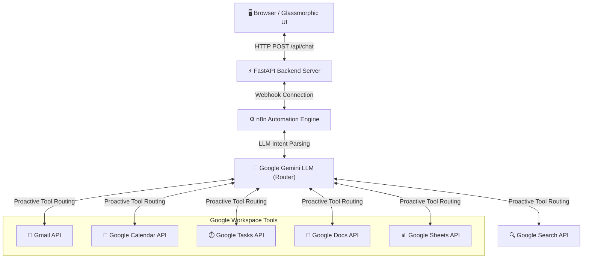

# SIA – Scientia Intelligent Assistant

A powerful AI-powered personal assistant developed by Rishabh Yadav. SIA is designed to streamline daily tasks, automate productivity workflows, and act as a central hub for personal operations. It connects a sleek, glassmorphic web dashboard to a robust backend integrated with custom agentic n8n workflows.

---

## Features

* **Conversational AI:** High-context natural conversations powered by Google Gemini.
* **Task Automation:** Create, read, and manage items in your task queue automatically.
* **Notes Management:** Create and update documents dynamically to store persistent thoughts.
* **Email Integration:** Read, draft, search, and send emails directly via conversational intent.
* **Knowledge Retrieval:** Access real-time internet search results to augment assistant responses.
* **Agent Workflows:** Intent-based routing that decides when and how to invoke integrated workspace tools.
* **Productivity Assistant:** Track active session uptimes and operations metrics directly on the dashboard.
* **Extensible Tool Architecture:** Modular structure designed for seamless integration of custom APIs.
* **Memory Support:** Retains message logs in local browser storage for persistence across reloads.
* **Custom Integrations:** Connects directly with the n8n automation engine to combine workflows.

---

## Architecture

The diagram below represents the request flow and service structure of SIA:



---

## Technology Stack

SIA automatically utilizes and integrates the following tech stack:

* **Backend Framework:** FastAPI (Python 3.12+)
* **ASGI Server:** Uvicorn
* **HTTP Client:** Requests
* **Frontend UI:** Vanilla HTML5, CSS3 (Custom Glassmorphism), and modern asynchronous JavaScript
* **Agent Workflows & Orchestration:** n8n Workflow Automation (Cloud/Self-Hosted)
* **LLM Core:** Google Gemini
* **Dependency Manager:** uv / pip

---

## Project Structure

Below is the complete folder structure tree of the SIA project:

```text
.
├── .env.example          # Environment variables template file
├── .gitignore            # Git exclusion patterns list
├── .python-version       # Python environment definition file
├── main.py               # FastAPI backend routing and serving entry point
├── pyproject.toml        # Project metadata & Python dependencies
├── README.md             # Professional documentation and guide
├── requirements.txt      # Autogenerated flat dependencies lockfile
├── static/               # Client-side web dashboard assets
│   ├── app.js            # Frontend chat interface logic and animations
│   ├── index.html        # Main dashboard structure & layout
│   └── styles.css        # Premium custom Glassmorphism CSS styling
├── sysprompt.md          # System prompts for the agent's behavior
├── test_webhook.py       # Helper testing script for the n8n webhooks
└── uv.lock               # uv package dependency lockfile
```

---

## Installation

### Prerequisites

Ensure you have **Python 3.12+** installed on your system. It is also recommended to have [uv](https://github.com/astral-sh/uv) installed for faster package resolution.

### Steps

1. **Clone the Repository:**
   ```bash
   git clone https://github.com/Rishabh-Scientia/SIA-Scientia-Intelligent-Agent-.git
   cd SIA-Scientia-Intelligent-Agent-
   ```

2. **Install Dependencies:**
   * **Using `uv` (Recommended):**
     ```bash
     uv sync
     ```
   * **Using standard `pip`:**
     ```bash
     pip install -r requirements.txt
     ```

---

## Environment Variables

SIA requires an active webhook link to communicate with the n8n orchestration workflow.

1. Copy the environment template:
   ```bash
   cp .env.example .env
   ```
2. Open `.env` in a text editor and update the webhook URL:
   ```env
   N8N_WEBHOOK_URL=https://your-n8n-instance-url/webhook/your-webhook-id
   ```

---

## Running Locally

To run the application locally:

1. **Activate Environment:**
   * If using `uv`:
     ```bash
     uv run uvicorn main:app --reload
     ```
   * If using `pip`/`venv`:
     ```bash
     # Activate your virtual environment first, then run:
     uvicorn main:app --reload
     ```

2. **Access the Application:**
   Open your browser and navigate to:  
   **[http://127.0.0.1:8000](http://127.0.0.1:8000)**

---

## Future Roadmap

* **Calendar Integration:** Deepen two-way scheduling sync with calendar updates.
* **Voice Assistant:** Add speech-to-text and text-to-speech for hands-free interactions.
* **Mobile Application:** Build a responsive hybrid mobile application.
* **Multi-Agent Workflows:** Orchestrate tasks across specialized sub-agents.
* **Autonomous Task Execution:** Schedule and run background jobs without manual triggers.
* **Advanced Memory System:** Introduce vector-based long-term semantic memory.

---

## Author

**Rishabh Yadav**  
GitHub: [@Rishabh-Scientia](https://github.com/Rishabh-Scientia)

---

## License

This project is licensed under the MIT License - see the LICENSE file for details.
